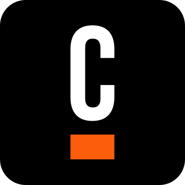
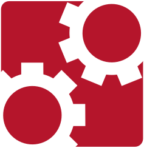
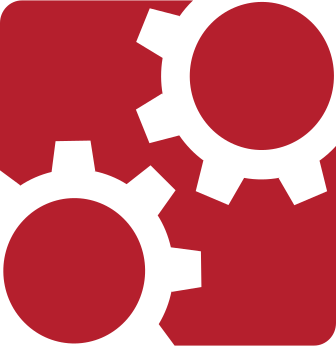
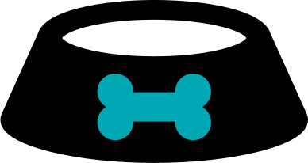
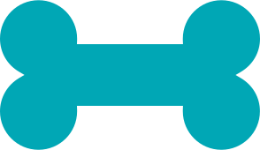
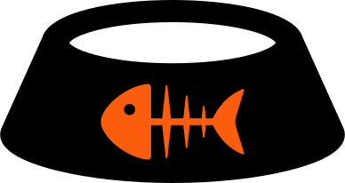
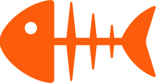
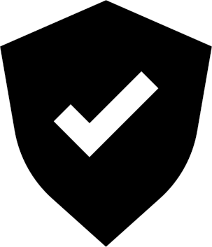

[](https://github.com/camunda-community-hub/community)
[](https://github.com/Camunda-Community-Hub/community/blob/main/extension-lifecycle.md#incubating-)


# Element Template SVG converter

With Camunda 8 you are now able to attach custom icons to items in Element Templates. SVGs (Scalable Vector Graphics) are ideal since they are vector, rather than raster, diagrams meaning they can scale infinitely in size while retaining their original fidelity. This utility will convert SVG diagrams for use as 18px by 18px task icons. A growing library of converted icons is available (see below) for you to copy and paste into an Element Template file. Or you can use this sample [Element Template file](./element-template-sample/elementTemplates.json) to access all of the icons at once. Note, the elements have been associated with User Tasks and can be changed as needed.


# Converted SVGs
You can simply copy and paste these ready made snippets into the ```"icon": { "contents":``` portion of your Element Template entry. They have been created at a width of 18px. Click on image to be brought to the Element Template SVG snippet. Note, with the introduction of Modeler 5.2 the 18px by 18px icon dimensions are strictly enforced which will result in shrunken icons in some cases.


<h2> Camunda Logos </h2>

<table>
<tr><td width="150px" align=center><b>Black</b></td><td width="150px" align=center><b>Orange</b></td><td width="150px" align=center><b>28px wide</b></td><td width="150px" align=center><b>Animated Classic</b></td><td width="150px" align=center><b>Classic</b></td></tr>
<tr><td><a href="./converted-svg-snippets/CamundaLogo.txt"></a></td><td><a href="./converted-svg-snippets/orangeCamundaLogo.txt"></a></td><td><a href="./converted-svg-snippets/camunda.txt"></a></td><td><a href="./converted-svg-snippets/CamundaClassicLogoAnimated.txt"></a></td><td><a href="./converted-svg-snippets/CamundaClassicLogo.txt"></a></td></tr>
<table>

<h2> Camundamojis </h2>

<table>
<tr><td width="150px" align=center><b>Happy</b></td><td width="150px" align=center><b>Neutral</b></td><td width="150px" align=center><b>Concerned</b></td><td width="150px" align=center><b>Mad</b></td></tr>
<tr><td><a href="./converted-svg-snippets/happy.txt"></a></td><td><a href="./converted-svg-snippets/meh.txt"></a></td><td><a href="./converted-svg-snippets/emojiConcerned.txt"></a></td><td><a href="./converted-svg-snippets/mad.txt"></a></td></tr>
<table>

<h2> Friends </h2>

<table>
<tr><td width="150px" align=center><b>Extraterrestrial</b></td><td width="150px" align=center><b>Blue Robot</b></td><td width="150px" align=center><b>Yellow Robot</b></td><td width="150px" align=center><b>Green Monster</b></td><td width="150px" align=center><b>Orange Monster</b></td><td width="150px" align=center><b>Dude</b></td><td width="150px" align=center><b>Pirate</b></td><td width="150px" align=center><b>Pigeon Hawk</b></td></tr>
<tr><td><a href="./converted-svg-snippets/alien.txt"></a></td><td><a href="./converted-svg-snippets/blueRobot.txt"></a></td><td><a href="./converted-svg-snippets/yellowRobot.txt"></a></td><td><a href="./converted-svg-snippets/greenMonster.txt"></a></td><td><a href="./converted-svg-snippets/orangeMonster.txt"></a></td><td><a href="./converted-svg-snippets/dude.txt"></a></td><td><a href="./converted-svg-snippets/pirate.txt"></a></td><td><a href="./converted-svg-snippets/pigeonHawk.txt"></a></td></tr>
<table>

<h2> Coffee </h2>

<table>
<tr><td width="150px" align=center><b>Coffee cup</b></td><td width="150px" align=center><b>Grey coffee cup</b></td><td width="150px" align=center><b>Coffee circle</b></td><td width="150px" align=center><b>Yellow coffee circle</b></td></tr>
<tr><td><a href="./converted-svg-snippets/coffeeCup.txt"></a></td><td><a href="./converted-svg-snippets/greyCoffeeCup.txt"></a></td><td><a href="./converted-svg-snippets/coffeeCircle.txt"></a></td><td><a href="./converted-svg-snippets/yellowCoffeeCircle.txt"></a></td></tr>
<table>

<h2> Other logos </h2>

<table>
<tr><td width="150px" align=center><b>Github</b></td><td width="150px" align=center><b>Slack</b></td><td width="150px" align=center><b>Stack Overflow</b></td><td width="150px" align=center><b>Twitter</b></td><td width="150px" align=center><b>YouTube</b></td><td width="150px" align=center><b>LinkedIn</b></td><td width="150px" align=center><b>Facebook</b></td></tr>
<tr><td><a href="./converted-svg-snippets/github_black.txt"></a></td><td><a href="./converted-svg-snippets/slack_black.txt"></a></td><td><a href="./converted-svg-snippets/stack-overflow_black.txt"></a></td><td><a href="./converted-svg-snippets/twitter_black.txt"></a></td><td><a href="./converted-svg-snippets/youtube_black.txt"></a></td><td><a href="./converted-svg-snippets/linkedin_black.txt"></a></td><td><a href="./converted-svg-snippets/facebook_black.txt"></a></td></tr>
<table>

<h2> For the dogs </h2>

<table>
<tr><td width="150px" align=center><b>Dog food bowl</b></td><td width="150px" align=center><b>Teal dog food bowl</b></td><td width="150px" align=center><b>Dog bone</b></td><td width="150px" align=center><b>Teal dog bone</b></td></tr>
<tr><td><a href="./converted-svg-snippets/dogFoodBowl.txt"></a></td><td><a href="./converted-svg-snippets/tealDogFoodBowl.txt"></a></td><td><a href="./converted-svg-snippets/dogBone.txt"></a></td><td><a href="./converted-svg-snippets/tealDogBone.txt"></a></td></tr>
<table>

<h2> For the cats </h2>

<table>
<tr><td width="150px" align=center><b>Cat food bowl</b></td><td width="150px" align=center><b>Orange dog food bowl</b></td><td width="150px" align=center><b>Cat treat</b></td><td width="150px" align=center><b>Orange cat treat</b></td></tr>
<tr><td><a href="./converted-svg-snippets/catFoodBowl.txt"></a></td><td><a href="./converted-svg-snippets/orangeCatFoodBowl.txt"></a></td><td><a href="./converted-svg-snippets/fishTreat.txt"></a></td><td><a href="./converted-svg-snippets/orangeFishTreat.txt"></a></td></tr>
<table>

<h2> Huh? </h2>

<table>
<tr><td width="150px" align=center><b>Question mark</b></td><td width="150px" align=center><b>Blue question mark</b></td></tr>
<tr><td><a href="./converted-svg-snippets/questionMark.txt"></a></td><td><a href="./converted-svg-snippets/blueQuestionMark.txt"></a></td></tr>
</table>

<h2>Fun with flags</h2>
<p>Check out the available flag icons [here](./fun-with-flags/README.md). Note, they are still being converted. If you see a header struck through it means the icon either partially works or not at all. We are working to get all of the flags converted and if you have one you'd like to see let us know by creating an issue and we'll make it a priority. You can find the original source for the flag SVGs here: [https://flagicons.lipis.dev/](https://flagicons.lipis.dev/)

<h2> The rest </h2>

<table>
<tr><td width="100px"><a href="./converted-svg-snippets/add-user-team-member_black.txt"></a></td><td width="100px"><a href="./converted-svg-snippets/add-workflow_black_black.txt"></a></td><td width="100px"><a href="./converted-svg-snippets/AI_black.txt"></a></td><td width="100px"><a href="./converted-svg-snippets/alignment_black.txt"></a></td><td width="100px"><a href="./converted-svg-snippets/ambition_black.txt"></a></td><td width="100px"><a href="./converted-svg-snippets/analyze-processes_black.txt"></a></td><td width="100px"><a href="./converted-svg-snippets/announcement_black.txt"></a></td><td width="100px"><a href="./converted-svg-snippets/API_black.txt"></a></td><td width="100px"><a href="./converted-svg-snippets/balance_black.txt"></a></td><td width="100px"><a href="./converted-svg-snippets/batch-process-migration_black.txt"></a></td></tr><tr><td width="100px"><a href="./converted-svg-snippets/blog_black.txt"></a></td><td width="100px"><a href="./converted-svg-snippets/BPM-gear_black.txt"></a></td><td width="100px"><a href="./converted-svg-snippets/BPMN-2.0_black.txt"></a></td><td width="100px"><a href="./converted-svg-snippets/bpmn-resources_black.txt"></a></td><td width="100px"><a href="./converted-svg-snippets/build-process-workflow_black.txt"></a></td><td width="100px"><a href="./converted-svg-snippets/business-suitcase_black.txt"></a></td><td width="100px"><a href="./converted-svg-snippets/calendar-events_black.txt"></a></td><td width="100px"><a href="./converted-svg-snippets/calendar-signup_black.txt"></a></td><td width="100px"><a href="./converted-svg-snippets/Camunda-8-c8_black.txt"></a></td><td width="100px"><a href="./converted-svg-snippets/case-study_black.txt"></a></td></tr><tr><td width="100px"><a href="./converted-svg-snippets/checklist-audit-logging_black.txt"></a></td><td width="100px"><a href="./converted-svg-snippets/checklist-rules_black.txt"></a></td><td width="100px"><a href="./converted-svg-snippets/cloud-console_black.txt"></a></td><td width="100px"><a href="./converted-svg-snippets/cloud-window_black.txt"></a></td><td width="100px"><a href="./converted-svg-snippets/cloud_black.txt"></a></td><td width="100px"><a href="./converted-svg-snippets/code-architecture-review_black.txt"></a></td><td width="100px"><a href="./converted-svg-snippets/confused-person_black.txt"></a></td><td width="100px"><a href="./converted-svg-snippets/connectors_black.txt"></a></td><td width="100px"><a href="./converted-svg-snippets/consulting_black.txt"></a></td><td width="100px"><a href="./converted-svg-snippets/conversation_black.txt"></a></td></tr><tr><td width="100px"><a href="./converted-svg-snippets/cycle_black.txt"></a></td><td width="100px"><a href="./converted-svg-snippets/database_black.txt"></a></td><td width="100px"><a href="./converted-svg-snippets/decision-engine_black.txt"></a></td><td width="100px"><a href="./converted-svg-snippets/digital-transformation_black.txt"></a></td><td width="100px"><a href="./converted-svg-snippets/DMN_black.txt"></a></td><td width="100px"><a href="./converted-svg-snippets/documentation_black.txt"></a></td><td width="100px"><a href="./converted-svg-snippets/email_black.txt"></a></td><td width="100px"><a href="./converted-svg-snippets/EUR-USD_black.txt"></a></td><td width="100px"><a href="./converted-svg-snippets/excellence_black.txt"></a></td><td width="100px"><a href="./converted-svg-snippets/FE_black.txt"></a></td></tr><tr><td width="100px"><a href="./converted-svg-snippets/forms_black.txt"></a></td><td width="100px"><a href="./converted-svg-snippets/forum-chat_black.txt"></a></td><td width="100px"><a href="./converted-svg-snippets/FO_black.txt"></a></td><td width="100px"><a href="./converted-svg-snippets/global-cloud_black.txt"></a></td><td width="100px"><a href="./converted-svg-snippets/global_black.txt"></a></td><td width="100px"><a href="./converted-svg-snippets/growth-bar-graph_black.txt"></a></td><td width="100px"><a href="./converted-svg-snippets/handshake-onboarding_black.txt"></a></td><td width="100px"><a href="./converted-svg-snippets/heart_black.txt"></a></td><td width="100px"><a href="./converted-svg-snippets/homegrown-workflow_black.txt"></a></td><td width="100px"><a href="./converted-svg-snippets/horizontal-scalability_black.txt"></a></td></tr><tr><td width="100px"><a href="./converted-svg-snippets/humor_black.txt"></a></td><td width="100px"><a href="./converted-svg-snippets/IAM-identity_black.txt"></a></td><td width="100px"><a href="./converted-svg-snippets/idea_black.txt"></a></td><td width="100px"><a href="./converted-svg-snippets/innovation-growth_black.txt"></a></td><td width="100px"><a href="./converted-svg-snippets/inspect-review-data_black.txt"></a></td><td width="100px"><a href="./converted-svg-snippets/integration-framework_black.txt"></a></td><td width="100px"><a href="./converted-svg-snippets/integration_black.txt"></a></td><td width="100px"><a href="./converted-svg-snippets/integrity_black.txt"></a></td><td width="100px"><a href="./converted-svg-snippets/international-team_black.txt"></a></td><td width="100px"><a href="./converted-svg-snippets/IoT_black.txt"></a></td></tr><tr><td width="100px"><a href="./converted-svg-snippets/legacy-BPMS_black.txt"></a></td><td width="100px"><a href="./converted-svg-snippets/lightning_black.txt"></a></td><td width="100px"><a href="./converted-svg-snippets/link-pop-out_black.txt"></a></td><td width="100px"><a href="./converted-svg-snippets/live-video_black.txt"></a></td><td width="100px"><a href="./converted-svg-snippets/local-communities_black.txt"></a></td><td width="100px"><a href="./converted-svg-snippets/microservices-orchestration_black.txt"></a></td><td width="100px"><a href="./converted-svg-snippets/modeler-desktop_black.txt"></a></td><td width="100px"><a href="./converted-svg-snippets/modeler-web_black.txt"></a></td><td width="100px"><a href="./converted-svg-snippets/modeler_black.txt"></a></td><td width="100px"><a href="./converted-svg-snippets/modeling-workshop_black.txt"></a></td></tr><tr><td width="100px"><a href="./converted-svg-snippets/mountain-flag_black.txt"></a></td><td width="100px"><a href="./converted-svg-snippets/network_black.txt"></a></td><td width="100px"><a href="./converted-svg-snippets/newbie_black.txt"></a></td><td width="100px"><a href="./converted-svg-snippets/newsletter_black.txt"></a></td><td width="100px"><a href="./converted-svg-snippets/news_black.txt"></a></td><td width="100px"><a href="./converted-svg-snippets/onboarding-hand-gear_black.txt"></a></td><td width="100px"><a href="./converted-svg-snippets/open-source-initiative_black.txt"></a></td><td width="100px"><a href="./converted-svg-snippets/open-space-meeting_black.txt"></a></td><td width="100px"><a href="./converted-svg-snippets/operate-cockpit_black.txt"></a></td><td width="100px"><a href="./converted-svg-snippets/optimize-workshop_black.txt"></a></td></tr><tr><td width="100px"><a href="./converted-svg-snippets/people-team_black.txt"></a></td><td width="100px"><a href="./converted-svg-snippets/people_black.txt"></a></td><td width="100px"><a href="./converted-svg-snippets/person-user_black.txt"></a></td><td width="100px"><a href="./converted-svg-snippets/play-button_black.txt"></a></td><td width="100px"><a href="./converted-svg-snippets/podcast-microphone_black.txt"></a></td><td width="100px"><a href="./converted-svg-snippets/power_black.txt"></a></td><td width="100px"><a href="./converted-svg-snippets/priority-patches_black.txt"></a></td><td width="100px"><a href="./converted-svg-snippets/public-sector_black.txt"></a></td><td width="100px"><a href="./converted-svg-snippets/rapid-growth_black.txt"></a></td><td width="100px"><a href="./converted-svg-snippets/redesign_black.txt"></a></td></tr><tr><td width="100px"><a href="./converted-svg-snippets/resources_black.txt"></a></td><td width="100px"><a href="./converted-svg-snippets/review-optimization_black.txt"></a></td><td width="100px"><a href="./converted-svg-snippets/rocket_black.txt"></a></td><td width="100px"><a href="./converted-svg-snippets/rpa-confused_black.txt"></a></td><td width="100px"><a href="./converted-svg-snippets/rpa_black.txt"></a></td><td width="100px"><a href="./converted-svg-snippets/search-online-software_black.txt"></a></td><td width="100px"><a href="./converted-svg-snippets/search-visibility_black.txt"></a></td><td width="100px"><a href="./converted-svg-snippets/security-lock_black.txt"></a></td><td width="100px"><a href="./converted-svg-snippets/sign-up_black.txt"></a></td><td width="100px"><a href="./converted-svg-snippets/software-product-workflow_black.txt"></a></td></tr><tr><td width="100px"><a href="./converted-svg-snippets/speed-scalability_black.txt"></a></td><td width="100px"><a href="./converted-svg-snippets/stability_black.txt"></a></td><td width="100px"><a href="./converted-svg-snippets/stagnation_black.txt"></a></td><td width="100px"><a href="./converted-svg-snippets/startup-rocket_black.txt"></a></td><td width="100px"><a href="./converted-svg-snippets/support-heart-in-hand_black.txt"></a></td><td width="100px"><a href="./converted-svg-snippets/support-smiley_black.txt"></a></td><td width="100px"><a href="./converted-svg-snippets/systems_black.txt"></a></td><td width="100px"><a href="./converted-svg-snippets/talent_black.txt"></a></td><td width="100px"><a href="./converted-svg-snippets/task-level-orchestration_black.txt"></a></td><td width="100px"><a href="./converted-svg-snippets/tasklist_black.txt"></a></td></tr><tr><td width="100px"><a href="./converted-svg-snippets/technical-support_black.txt"></a></td><td width="100px"><a href="./converted-svg-snippets/telco-wifi_black.txt"></a></td><td width="100px"><a href="./converted-svg-snippets/thought-leadership_black.txt"></a></td><td width="100px"><a href="./converted-svg-snippets/time-speed_black.txt"></a></td><td width="100px"><a href="./converted-svg-snippets/training-onboarding_black.txt"></a></td><td width="100px"><a href="./converted-svg-snippets/training-presentation_black.txt"></a></td><td width="100px"><a href="./converted-svg-snippets/training_black.txt"></a></td><td width="100px"><a href="./converted-svg-snippets/transparency-reporting_black.txt"></a></td><td width="100px"><a href="./converted-svg-snippets/transparency_black.txt"></a></td><td width="100px"><a href="./converted-svg-snippets/tutorial-video_black.txt"></a></td></tr><tr><td width="100px"><a href="./converted-svg-snippets/USD_black.txt"></a></td><td width="100px"><a href="./converted-svg-snippets/video-camera_black.txt"></a></td><td width="100px"><a href="./converted-svg-snippets/video-film_black.txt"></a></td><td width="100px"><a href="./converted-svg-snippets/video-laptop_black.txt"></a></td><td width="100px"><a href="./converted-svg-snippets/waterfall_black.txt"></a></td><td width="100px"><a href="./converted-svg-snippets/whitepaper_black.txt"></a></td><td width="100px"><a href="./converted-svg-snippets/workflow-engine-zeebe_black.txt"></a></td></tr><tr></table>

An example of its use in an Element Template entry (see contents):

```
{
	"$schema": "https://unpkg.com/@camunda/zeebe-element-templates-json-schema/resources/schema.json",
	"name": "Feed the cat",
	"icon": { "contents": "data:image/svg+xml,%3Csvg xmlns='http://www.w3.org/2000/svg' width='18' height='9.565979' viewBox='0 0 18 9.565979' %3E%3Ccircle r='0.29226804' cx='6.7592783' cy='5.7293816'/%3E%3Cpath d='M 17.902576 6.643299 h 0.0046391753 L 15.810308 1.980928 h -0.0046391753 c 0.0 -0.0046391753,-0.0046391753 -0.013917526,-0.0046391753 -0.018556701 C 15.406701 0.6170103,12.094331 0.0,9.0 0.0 S 2.5932992 0.6170103,2.1989691 1.9623711 c -0.0046391753 0.0046391753,-0.0046391753 0.013917526,-0.0046391753 0.018556701 h -0.0046391753 L 0.0927835 6.643299 h 0.0046391753 c -0.064948454 0.12525773,-0.097422674 0.25979382,-0.097422674 0.39896908 c 0.0 0.75618553,0.9881443 1.3824742,2.931959 1.8695877 c 1.7025774 0.42216498,3.8551545 0.6541237,6.0680413 0.6541237 s 4.3654637 -0.23195876,6.0680413 -0.6541237 c 1.9484537 -0.4824742,2.931959 -1.1134021,2.931959 -1.8695877 C 18.0 6.903093,17.967525 6.7685566,17.902576 6.643299 L 17.902576 6.643299 M 12.32165 6.634021 l 0.42216498 1.3685567 c 0.013917526 0.041752577,-0.027835052 0.07886598,-0.06958763 0.064948454 c -0.93247426 -0.35721648,-1.401031 -1.1690723,-1.563402 -1.5262887 h -0.3618557 l -0.06958763 0.61237115 c -0.0046391753 0.05103093,-0.08350515 0.05103093,-0.08814433 0.0 l -0.06958763 -0.61237115 h -0.61237115 l -0.12525773 1.1551546 c -0.0046391753 0.05103093,-0.08350515 0.05103093,-0.08814433 0.0 l -0.12525773 -1.1551546 h -0.64484537 l -0.185567 1.6979381 c -0.0046391753 0.05103093,-0.08350515 0.05103093,-0.08814433 0.0 l -0.185567 -1.6979381 h -0.5798969 v 1.6283505 c 0.0 0.10206186,-0.08814433 0.18092784,-0.19020618 0.17164949 c -1.164433 -0.11597938,-2.4355671 -1.2386599,-2.4355671 -1.9762886 s 1.271134 -1.8649485,2.4355671 -1.9762886 c 0.10206186 -0.0092783505,0.19020618 0.06958763,0.19020618 0.17164949 v 1.6283505 h 0.5798969 l 0.185567 -1.6979381 c 0.0046391753 -0.05103093,0.08350515 -0.05103093,0.08814433 0.0 l 0.185567 1.6979381 h 0.64484537 l 0.12525773 -1.1551546 c 0.0046391753 -0.05103093,0.08350515 -0.05103093,0.08814433 0.0 l 0.12525773 1.1551546 h 0.61237115 l 0.06958763 -0.61237115 c 0.0046391753 -0.05103093,0.08350515 -0.05103093,0.08814433 0.0 l 0.06958763 0.61237115 h 0.3618557 c 0.1670103 -0.35721648,0.63092786 -1.1690723,1.563402 -1.5262887 c 0.041752577 -0.013917526,0.08350515 0.023195876,0.06958763 0.064948454 l -0.42216498 1.3685567 C 12.265979 6.272165,12.265979 6.4577317,12.32165 6.634021 L 12.32165 6.634021 M 13.022165 2.8716495 c -1.0716496 0.28298968,-2.5005155 0.43608245,-4.022165 0.43608245 s -2.9505155 -0.15309279,-4.022165 -0.43608245 C 3.8922682 2.5886598,3.623196 2.2917526,3.6185567 2.2360826 c 0.0046391753 -0.032474227,0.08814433 -0.13917527,0.34793815 -0.27371135 c 0.20876288 -0.11134021,0.528866 -0.23659794,1.0113401 -0.36649486 c 1.0716496 -0.28298968,2.5005155 -0.43608245,4.022165 -0.43608245 s 2.9505155 0.15309279,4.022165 0.43608245 c 0.48711342 0.12525773,0.80721647 0.25515464,1.0159794 0.36649486 c 0.25979382 0.13453609,0.34329897 0.2412371,0.34793815 0.27371135 C 14.372165 2.2917526,14.107733 2.5886598,13.022165 2.8716495 L 13.022165 2.8716495 z'/%3E%3C/svg%3E"
		},
	"description": "Feed the cat",
	"appliesTo": [
		"bpmn:UserTask"
	],
	"id": "catFoodBowl",
	"documentationRef": "https://docs.camunda.io",
	"elementType": {
		"value": "bpmn:UserTask"
	},
	"properties": [
		{
			"binding": {
				"name": "name",
				"type": "property"
			},
			"type": "String",
			"value": "Feed the cat"
		}
	]
}
```

# The SVG converter utilities
If you want to create your own icons you can use these converters to do so. Bear in mind, the simpler the SVG, the better the chances of success. SVGs using arcane transforms may return odd results until the algorithms can handle them. Also keep in mind the end result will fit into an 18x18 box and an SVG that looks great at 500x500 may not look as great at 18x18 until you zoom in. If you want to convert a single SVG use the **RescaleImage** class which can be found here:

```src/main/java/org/svg/utilities/RescaleImage```

It uses a static main method. The six arguments to pass into the main class are:

```"SVG input file location" "Modeler Element Template file location" "Icon width in pixels" "Element Template ID" "Element Template Name/Description/etc" "What BPMN elements it will apply to"```

If you have a directory of SVG icons to convert you can use the **BulkConverter** class which can be found here:

```src/main/java/org/svg/utilities/BulkConverter```

It also uses a static main method. The six arguments to pass into the main class are:

```"SVG input directory" "Directory of converted SVG snippets" "Modeler Element Template file location" "Icon width in pixels" "Element Template ID" "Element Template Name/Description/etc" "What BPMN elements it will apply to" "Converted snippet directory" "Converted SVG directory"```

The converted snippet and SVG directories are only used if you plan to add to this repository as it makes updating the readme easier. Feel free to use throwaway directories. The Bulk Converter will be refactored for more streamlined functioning in later releases.